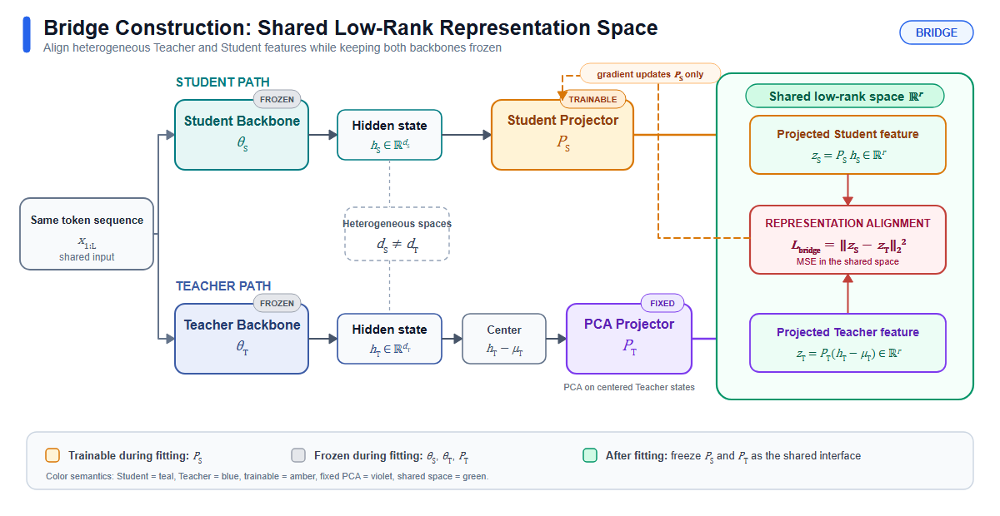

# Sequential Bridge-EMD → Sampled-token OPD

This repository is the public research snapshot for a two-stage distillation study built on the EOPD/OPRD experimental protocol:

1. **Representation stage:** align teacher and student layers with exact layer-level EMD in a frozen shared low-rank coordinate system.
2. **Output stage:** start from the EMD checkpoint and run the original sampled-token OPD objective alone.

The sequential schedule is deliberate. It avoids optimizing the representation and policy objectives against each other throughout the same run, while keeping the OPD stage directly comparable with the existing baseline.

## Results available now

All numbers are percentages under the same evaluation protocol (`n=8`, temperature `1.0`, `top_p=0.8`, maximum 8192 generated tokens, seed 42). EMD rank-sweep evaluations are still running and are therefore not reported as results.

| Method | MATH500 Avg@8 | MATH500 Pass@8 | AMC23 Avg@8 | AMC23 Pass@8 | AIME24 Avg@8 | AIME24 Pass@8 | Macro Avg@8 | Macro Pass@8 |
|---|---:|---:|---:|---:|---:|---:|---:|---:|
| Teacher reference (Qwen3-8B) | 84.125 | 95.200 | 67.500 | 92.500 | 25.833 | 53.333 | 59.153 | 80.344 |
| Student baseline | 4.150 | 28.200 | 2.813 | 15.000 | 0.417 | 3.333 | 2.460 | 15.511 |
| Sampled-token OPD | **62.175** | 84.000 | **34.063** | 67.500 | **7.083** | 20.000 | **34.440** | 57.167 |
| OPRD-Bridge, representation stage only | 23.525 | 73.600 | 16.563 | 55.000 | 2.500 | 6.667 | 14.196 | 45.089 |
| OPRD-Bridge → sampled-token OPD | 61.275 | **84.600** | 33.750 | 67.500 | 6.250 | **23.333** | 33.758 | **58.478** |

The completed sequential OPRD result is useful context: adding an aligned representation initialization changes the error profile and improves macro Pass@8, but does not automatically improve macro Avg@8. The Bridge-EMD rank sweep tests whether adaptive layer transport gives a better initialization.

Raw aggregate JSON files are under [`baselines/`](baselines/), and the machine-readable comparison is under [`results/`](results/).

## Running experiments

Snapshot at **2026-10-02 11:51 CST**:

| Bridge rank | Representation stage | OPD stage | Final evaluation |
|---:|---|---|---|
| 8 | complete (174/174) | running (37/174) | pending |
| 32 | complete (174/174) | running (19/174) | pending |
| 64 | running (125/174) | pending | pending |

These entries are progress records, not final scores. See [`docs/CURRENT_STATUS.md`](docs/CURRENT_STATUS.md).

## Shared protocol

- Teacher: `Qwen/Qwen3-8B`
- Student: `Qwen/Qwen3-1.7B-Base`
- Training set: the same 7,500-example MATH split used by the comparison runs
- Global batch / mini-batch / micro-batch: `128 / 32 / 1`
- Optimizer: AdamW, learning rate `3e-6`, cosine schedule, weight decay `0.01`
- Schedule: 3 epochs / 174 optimizer steps **per stage**
- Training response limit: 4096 tokens
- Seed: 42
- EMD: `lambda_emd=1.0`, `tau=1.0`, exact balanced transport
- Bridge sweep: ranks 8, 32, and 64; each bridge is frozen and SHA-256 locked
- OPD stage: representation distillation disabled; sampled-token OPD is unchanged

The training data object and evaluation instruction are held fixed across methods. Exact prompt and sampling details are recorded in [`docs/REPRODUCIBILITY.md`](docs/REPRODUCIBILITY.md).

## Repository map

- [`paper/`](paper/) — bibliography and the archived joint-objective manuscript draft; the sequential manuscript rewrite is pending final rank results
- [`code/verl_extensions/`](code/verl_extensions/) — exact EMD/Bridge implementation and modified VERL integration files used in the runs
- [`experiments/rank8/`](experiments/rank8/) — reference pipeline, launchers, tests, configuration, and frozen rank-8 bridge
- [`experiments/rank32/`](experiments/rank32/) and [`experiments/rank64/`](experiments/rank64/) — rank-specific configurations and frozen bridges
- [`baselines/`](baselines/) — completed teacher and OPRD→OPD aggregate evaluation files
- [`results/`](results/) — unified result table and live run snapshot
- [`docs/`](docs/) — current method, status, and reproduction notes, plus clearly marked historical planning documents
- [`figures/`](figures/) — paper figure and deterministic figure specification

## Scope

This is a work-in-progress research repository. Frozen Bridge tensors are included because they are small and required to reproduce the active runs. Model weights, optimizer checkpoints, datasets, rollout-level generations, server paths, and credentials are intentionally excluded.
